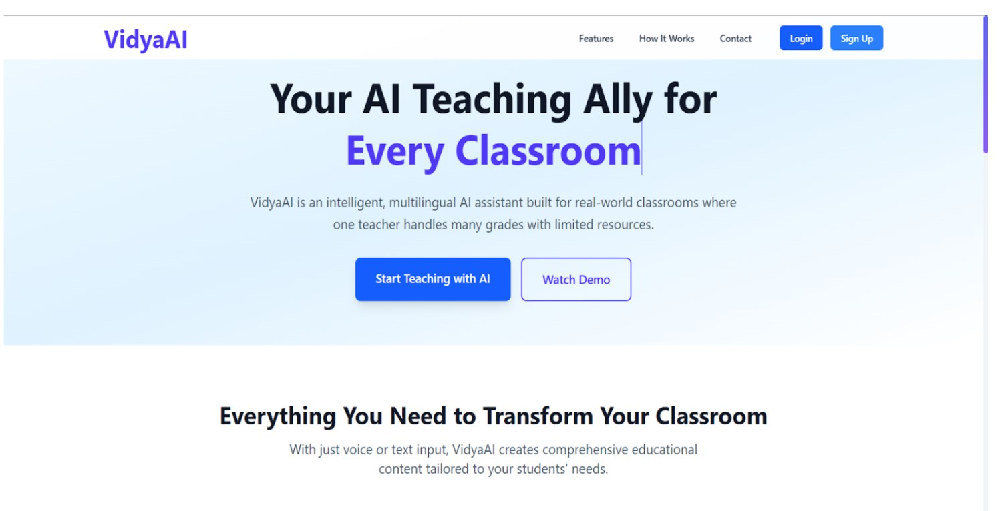
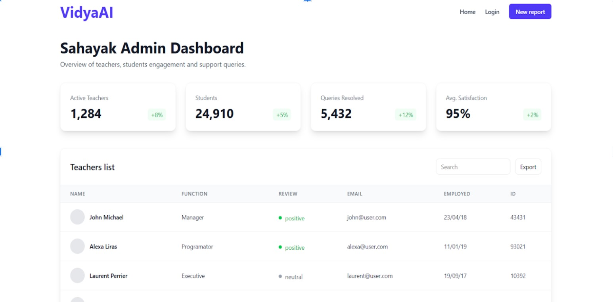
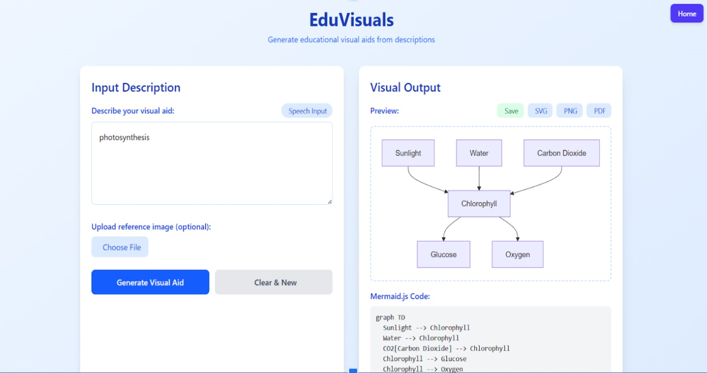
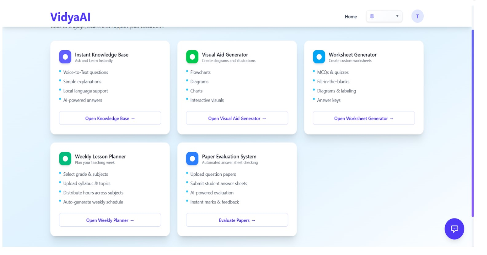
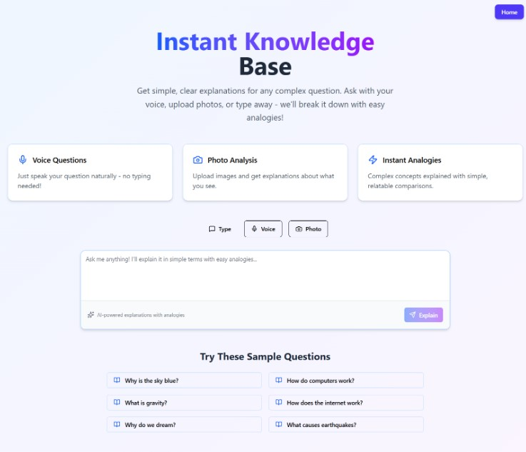

# VidyaAI — AI Teaching Assistant for Every Classroom

<div align="center">


An intelligent, multilingual AI assistant built for rural and multi-grade classrooms.

*Empowering teachers — not replacing them.*

</div>

---

## Table of Contents

- [About](#about)
- [Problem Statement](#problem-statement)
- [Features](#features)
- [Tech Stack](#tech-stack)
- [Project Structure](#project-structure)
- [Getting Started](#getting-started)
- [API Reference](#api-reference)
- [Screenshots](#screenshots)
- [Future Scope](#future-scope)
- [Team](#team)
- [License](#license)

---

## About

**VidyaAI** is an AI-powered teaching assistant built to support educators in rural and multi-grade classrooms — where a single teacher often manages multiple grade levels with limited resources.

Using voice or text input, VidyaAI can instantly generate localized lesson plans, create blackboard-friendly visual aids, suggest low-cost activities, answer queries in regional Indian languages, auto-check answer sheets, generate worksheets, and plan weekly schedules.

VidyaAI follows a **teacher-first approach** — reducing workload, supporting multiple languages, and working effectively even in low-resource environments. It aligns with India's **National Education Policy (NEP) 2020**, promoting multilingual and technology-driven learning.

---

## Problem Statement

In many rural and semi-urban schools across India:

- A single teacher manages multiple grades simultaneously
- Most content is in English or Hindi, creating language barriers for regional-language speakers
- Teachers spend excessive time on lesson preparation and assessment, leaving less time for direct teaching
- Most EdTech solutions are student-focused and require high-end devices or stable internet

VidyaAI addresses this with a unified, teacher-centric, multilingual AI assistant designed for low-resource environments.

---

## Features

| Feature | Description |
|---|---|
| AI Chat Bot | Real-time query answering for teachers and students |
| Instant Knowledge Mode | Topic-based content generation by grade level |
| Visual Aid Generator | Blackboard-ready diagrams and visuals |
| Worksheet Generator | Auto-generate subject-wise worksheets |
| Weekly Planner | AI-assisted weekly lesson scheduling |
| Paper Checking | Upload answer sheets for AI-based evaluation |
| Multilingual Support | Content in regional Indian languages via Google Translate |
| Voice Input | Voice-to-text input for hands-free interaction |
| Authentication | Teacher login, signup, and profile management |
| Admin Dashboard | Admin panel for user and content management |

---

## Tech Stack

### Frontend

| Technology | Version | Purpose |
|---|---|---|
| React | 19 | UI Framework |
| Vite | 7 | Build Tool |
| Tailwind CSS | 4 | Styling |
| React Router DOM | 7 | Client-side Routing |
| Framer Motion | latest | Animations |
| Mermaid.js | 11 | Diagram Rendering |
| jsPDF + html2canvas | latest | PDF Export |
| Lucide React | latest | Icons |

### Backend

| Technology | Version | Purpose |
|---|---|---|
| Django | 5 | Web Framework |
| Django REST Framework | latest | API Layer |
| Google Gemini AI | latest | AI Content Generation |
| MySQL / SQLite | — | Database |
| JWT (SimpleJWT) | latest | Authentication |
| OpenCV + Pytesseract | latest | OCR for Paper Checking |
| Gunicorn | latest | Production WSGI Server |
| python-decouple | latest | Environment Config |

---

## Project Structure

```
VidyaAI/
├── images/                          # Project screenshots
│
├── VidyaAI-frontend/                # React + Vite frontend
│   ├── public/
│   │   └── vidyaAIlogo.png
│   ├── src/
│   │   ├── components/
│   │   │   ├── Admin/               # Admin dashboard
│   │   │   ├── InstantKnowledgeMode/
│   │   │   ├── Landing/
│   │   │   ├── Login/
│   │   │   ├── PaperChecking/
│   │   │   ├── ShowProfile/
│   │   │   ├── Signup/
│   │   │   ├── Teacher/
│   │   │   ├── VisualAid/
│   │   │   ├── WeaklyPlanner/
│   │   │   ├── Worksheets/
│   │   │   ├── GoogleTranslate.jsx
│   │   │   └── VoiceInput.jsx
│   │   ├── AppRouter.jsx
│   │   └── main.jsx
│   ├── package.json
│   └── vite.config.js
│
└── VidyaAI_Backend/                 # Django REST API backend
    ├── VidyaAI_Backend/             # Django project config
    │   ├── settings.py
    │   └── urls.py
    ├── user_authentication/         # Login / signup / profile
    ├── vidyaAI_Bot/                 # AI chatbot
    ├── vidyaAI_instantKB/           # Instant knowledge base
    ├── visual_aid/                  # Visual aid generator
    ├── worksheets/                  # Worksheet generator
    ├── weaklyPlanner/               # Weekly planner
    ├── papercheck/                  # Answer sheet checker
    ├── manage.py
    ├── Procfile
    └── requirements.txt
```

---

## Getting Started

### Prerequisites

- Python 3.12+
- Node.js 18+
- npm or yarn
- Git

---

### Backend Setup

```bash
# 1. Clone the repo
git clone https://github.com/your-username/VidyaAI.git
cd VidyaAI/VidyaAI_Backend

# 2. Create and activate a virtual environment
python -m venv venv
source venv/bin/activate        # Windows: venv\Scripts\activate

# 3. Install dependencies
pip install -r requirements.txt

# 4. Configure environment variables
cp .env.example .env            # then fill in your values
```

`.env` file:

```env
SECRET_KEY=your_django_secret_key
DEBUG=True
DB_NAME=vidyaai
DB_USER=your_db_user
DB_PASSWORD=your_db_password
DB_HOST=localhost
DB_PORT=3306
GEMINI_API_KEY=your_google_gemini_api_key
ALLOWED_HOSTS=localhost,127.0.0.1
```

```bash
# 5. Run migrations
python manage.py migrate

# 6. (Optional) Create a superuser
python manage.py createsuperuser

# 7. Start the dev server
python manage.py runserver
```

Backend runs at `http://localhost:8000`

---

### Frontend Setup

```bash
# 1. Navigate to the frontend directory
cd VidyaAI/VidyaAI-frontend

# 2. Install dependencies
npm install

# 3. Configure environment
echo "VITE_API_BASE_URL=http://localhost:8000/api/v1" > .env

# 4. Start the dev server
npm run dev
```

Frontend runs at `http://localhost:5173`

```bash
# Production build
npm run build
```

---

## API Reference

| Method | Endpoint | Description |
|---|---|---|
| POST | `/api/v1/auth/register/` | Teacher registration |
| POST | `/api/v1/auth/login/` | Teacher login |
| GET | `/api/v1/auth/profile/` | Get teacher profile |
| POST | `/api/v1/chat/` | AI chatbot query |
| POST | `/api/v1/kbmode/` | Instant knowledge mode |
| POST | `/api/v1/visual/generate/` | Generate visual aid |
| POST | `/api/v1/worksheet/generate/` | Generate worksheet |
| POST | `/api/v1/planner/generate/` | Generate weekly plan |
| POST | `/api/v1/assessment/check/` | Upload and check answer sheet |

---

## Screenshots

<div align="center">







</div>

---

## Future Scope

- More regional languages — expanding support to all Indian state languages
- Student performance tracking with AI-driven adaptive analytics
- DIKSHA / SWAYAM integration — linking with national education portals
- Emotion and voice recognition to detect student engagement levels
- Teacher community platform for sharing AI-generated materials
- Generative multimedia — auto-generate animated lessons with voice-over

---

## Team

**Team Elevate** — K. K. Wagh Institute of Engineering Education & Research, Nashik
Department of Computer Engineering | A.Y. 2025–2026
Project Guide: Prof. Monali Mahajan

| Name | Roll No. |
|---|---|
| Bhavesh Dipak Kale | 21 |
| Tejaswini Hemraj Narkhede | 35 |
| Akash Shyam Shankapal | 55 |
| Khetesh Samadhan Deore | 67 |
| Aryan Rajesh Jadhav | 68 |

---

## License

This project is developed as part of the Project Based Learning (PBL) course at K. K. Wagh Institute of Engineering Education & Research. All rights reserved by the respective authors.

---

<div align="center">
  Built with care to empower every teacher, in every classroom.
</div>
